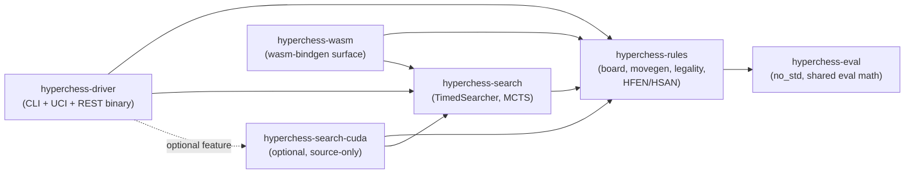
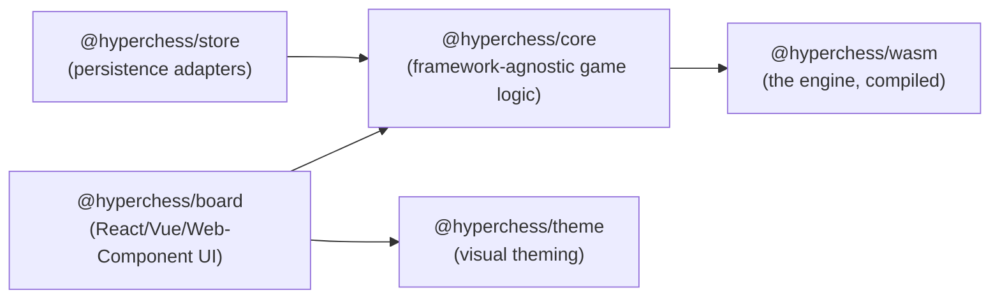
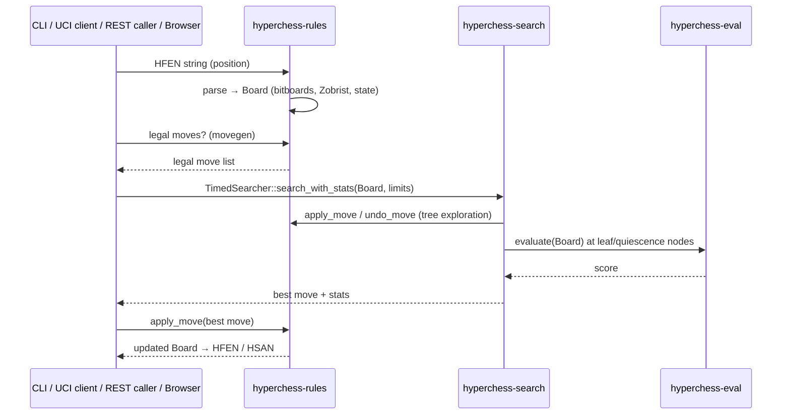

# Architecture

This is the repository-level companion to [`docs/search-architecture.md`](search-architecture.md)
(which is the deep dive on search internals) and the
[repository layout table](../README.md#repository-layout) in the root README: how the crates
and packages depend on each other, how a position flows from board state to a move decision,
and what the WASM/CUDA build variants change.

## Rust crate dependency graph

Dependency direction is one-way and enforced by design: `hyperchess-rules` never depends on
`hyperchess-search` or `hyperchess-driver` — legality must be computable without a search
algorithm in scope. `hyperchess-eval` is `no_std` and dependency-free so the exact same
evaluation arithmetic compiles into both the CPU path and the GPU kernel, guaranteeing the two
never numerically drift.

## TypeScript package dependency graph

All five packages are licensed `GPL-3.0-or-later` — see the
[embedding note](../README.md#license) in the root README for the recommended out-of-process
integration pattern (Web Worker + `postMessage`, or the REST driver over HTTP) for proprietary
applications. `@hyperchess/store` depends only on `@hyperchess/core`, and talks to its actual
storage backend (Postgres, SQLite, Firebase, Supabase, or in-memory) through a small adapter
interface rather than a hard dependency — see `packages/store/src/adapters/`.

## Data flow: a move, end to end

Every interface (CLI `play`, the UCI server, the REST API, and the WASM `WasmBoard`) is a thin
wrapper around exactly this pipeline — none of them re-implement legality, search, or
evaluation independently. See [`docs/search-architecture.md`](search-architecture.md) for what
happens inside the `Search` box, and [`docs/hyperchess-laws.md`](hyperchess-laws.md) for the
rules `Rules` enforces.

## Build variants

| Variant | Trigger | What changes |
| --- | --- | --- |
| **Default (CPU)** | `cargo build --workspace` | Pure-Rust search over `hyperchess-rules` + `hyperchess-search`; no GPU, no WASM |
| **CUDA-accelerated** | `cargo build -p hyperchess-driver --features cuda` | Pulls in `hyperchess-search-cuda` against a local, unpublished `rust-cuda` checkout — source-only, `publish = false`, never ships to crates.io |
| **WASM (browser)** | `pnpm --filter @hyperchess/wasm run build` (wraps `wasm-pack`) | Compiles `hyperchess-rules` + `hyperchess-search` with their `wasm` feature, exposes `WasmBoard` via `wasm-bindgen` |

## Interfaces at a glance

| Interface | Crate/module | Statefulness |
| --- | --- | --- |
| CLI (`hyperchess play`/`perft`/`show`/`gpu-info`/`bench-eval`) | `hyperchess-driver::cli` | Stateless per invocation |
| Native UCI server (`hyperchess uci`) | `hyperchess-driver::uci` | One board per session, stdin/stdout |
| REST/OpenAPI (`hyperchess api`) | `hyperchess-driver::api` | Fully stateless — no DB, no auth, no required env vars |
| WASM (`WasmBoard`) | `hyperchess-wasm` | In-memory in the browser tab; persistence is the embedding app's job (e.g. via `@hyperchess/store`) |

## Where to look for what

- **"Is this move legal?"** → `hyperchess-rules::board` (movegen).
- **"Why did the engine pick this move?"** → [`docs/search-architecture.md`](search-architecture.md).
- **"How is a position scored?"** → `hyperchess-eval` (shared math), wrapped by
  `hyperchess-rules`'s eval tool.
- **"How do I parse/write a position or a game?"** → `hyperchess-rules` HFEN/HSAN support; see
  [`docs/hyperchess-laws.md#6-notation`](hyperchess-laws.md#6-notation).
- **"How does the browser talk to the engine?"** → `hyperchess-wasm::board` and
  `packages/wasm`.
