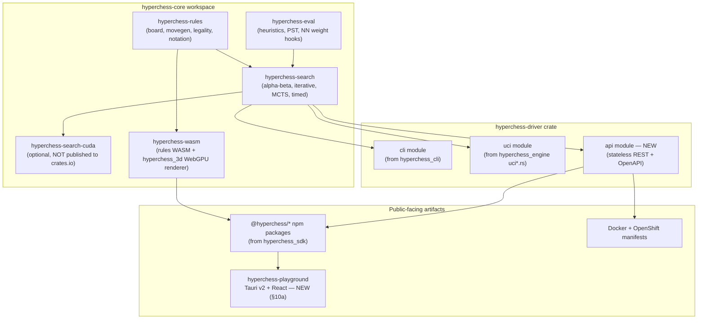

# HyperChess Core & Driver — Open-Source Extraction & Multiplatform Implementation Plan

**Status:** Phases 0–7 complete. All six Rust crates and all five npm packages (`@hyperchess/{core,board,store,theme,wasm}`) exist, build, and are tested — `pnpm -r test` passes 70 tests using the real built `@hyperchess/wasm` (not a mock). Phase 7 surfaced and fixed two latent bugs in the source repo's own root `tsconfig.json` (a `paths` alias pointing at source instead of `dist/`, and an inherited `noEmit: true` that let `tsc` silently emit nothing while exiting 0) — neither had ever been hit before because `board`/`store`/`theme` never had their own `tsconfig.json` to inherit them through. Known open items: the Phase 6 `wgpu` bundle-size trade-off (Phase 8), and ~57 pre-existing eslint issues in copied source (not a CI gate, documented not fixed). Phase 8 (new `packages/board-3d`) is next.
**Supersedes:** `docs/refactoring_proposal.md` (kept for history; this document fuses it with the
current architecture, closes gaps it missed, and turns it into an executable plan). Also incorporates
findings from `docs/.research/hyperchess-A-Strategic-Playbook-for-Open-Sourcing.md` — see §15.
**Target repo:** `/projects/kyrpy-projects/kyrpy-hyperchess/hyrperchess-core/` — this is the *real*,
already-created directory name (confirmed on disk, spelled the same way in the original prompt; not
a one-off typo as earlier assumed — see §13's naming decision). It's part of a larger, already-started
parent workspace at `/projects/kyrpy-projects/kyrpy-hyperchess/` — see §3.0.
**This repo (`kyrpy-hyperchess-rust`) is unaffected.** Nothing here is deleted or moved out of it —
everything is *copied* into the new repo, then the new repo lives independently.

---

## 0. Decisions Locked (from discussion)

| Question | Decision |
|---|---|
| AI training system (`hyperchess_ai`) | **Excluded.** Stays private (for now, under the sibling `hyperchess-ai/` workspace folder — see §3). Public core = rules + search + eval + CLI/UCI/API driver + WASM/UI only. |
| `hyperchess_web` / `hyperchess_admin` | **Untouched, stays private this phase.** No coupling to the new repo now. **Phase 13 (§12)** documents the future, separate decision to swap its frontend for the new app. |
| Tauri v2 + React app | **Staged, not one app.** Near-term: `apps/hyperchess-playground`, a developer-facing test/demo app (this plan's actual next build target, see §10a). Later, separately scoped: a full-featured consumer `hyperchess-app`, and a recreated training/ops app under `hyperchess-ai/` — neither designed here. |
| License | **GPLv3** (Stockfish/Fairy-Stockfish convention) — see §5 for what this means for the "zero-config in any website" goal, and the mitigation. Independently corroborated almost verbatim by the external research at `docs/.research/hyperchess-A-Strategic-Playbook-for-Open-Sourcing.md` — see §15. |
| Repo naming | The real, already-created directory is `hyrperchess-core` (not `hyperchess-core` — same spelling as the original prompt, confirmed on disk, not a one-off typo). This doc uses the real path. npm scope/crate names can still read `hyperchess-*` for branding regardless of the folder name — flagged as an open item in §13, not silently renamed. |
| Build output | **Centralized.** All build artifacts (`cargo target/`, `node_modules/`, Tauri bundles) route to `/projects/kyrpy-projects/kyrpy-hyperchess/hyperchess-builds/`, keeping every source tree in the workspace clean. See §9a. |
| Package DX verification | Before any public/private-registry publish, packages get installed and consumed from `npm.kyrpy.kyrpy.com` (not workspace symlinks) to simulate a real external developer. See §9b. |

---

## 1. What We Actually Have (corrects gaps in the original proposal)

The original `refactoring_proposal.md` was written without inspecting the real crate boundaries. Re-indexing the codebase surfaced several things that change the plan materially:

1. **A JS/TS SDK already exists and is already shaped like the target.** `src/hyperchess_sdk/` is a pnpm workspace with `@hyperchess/core`, `@hyperchess/board`, `@hyperchess/store`, `@hyperchess/theme`, and `@hyperchess/wasm` packages. `@hyperchess/core` is **already MIT-licensed**, already has clean `exports` (`./board`, `./moves`, `./game`, `./standalone`), and already depends on `@hyperchess/wasm` as a workspace package. This is not something to build — it's something to **relocate and keep polishing**.
2. **WASM export already exists.** `src/hyperchess/src/wasm.rs`, and the crate already has a `wasm` cargo feature that turns off `rayon`/`num_cpus` for WASM builds (`src/hyperchess/src/lib.rs`). The rules engine was built WASM-aware from the start.
3. **A 3D renderer already exists and is already web-targeted.** `src/hyperchess_3d` compiles to WASM via `wasm-bindgen` and targets **WebGPU + WebGL** through `wgpu` (not a native-only prototype). This directly satisfies the "3D board/pieces" UI ask — it needs a packaging pass, not a rewrite.
4. **Search code lives in the rules crate, not the engine crate.** `src/hyperchess/src/bots/` has `alphabeta.rs`, `guided_alphabeta.rs`, `iterative.rs`, `mcts.rs`, `pro.rs`, `timed.rs` — all CPU search. `src/hyperchess_engine` is actually the **UCI protocol + CUDA/GPU layer** (`uci*.rs`, `cuda_backend.rs`, `cuda_mcts.rs`, `gpu_alphabeta.rs`, `kernels/`), described in its own `Cargo.toml` as "Shared HyperChess engine — UCI client/server, CPU MCTS, optional CUDA backend" with `cuda` as an **optional, non-default feature**. This confirms the original proposal's "leaky separation" finding, but the fix is more surgical than a full rewrite: split `hyperchess_engine` along its existing feature boundary.
5. **`hyperchess_engine`'s CUDA feature depends on local filesystem paths**, not crates.io/git deps:
   ```toml
   cust = { path = "/projects/github/rust-cuda/crates/cust", optional = true }
   cust_raw = { path = "/projects/github/rust-cuda/crates/cust_raw", ... }
   cuda_builder = { path = "/projects/github/rust-cuda/crates/cuda_builder", ... }
   ```
   **This is a hard blocker for `cargo publish`** — crates.io rejects publishing a crate with unversioned path dependencies. See §6.
6. **There are two separate private web services, not one.** `hyperchess_web` (game server: DB, mailer, metrics, background jobs, static assets) and `hyperchess_admin` (a small Axum auth API, timing-safe login, depends on `hyperchess_db`). Both are explicitly out of scope per §0 and stay as-is.
7. **You already have a working OpenShift deployment** — `src/hyperchess-os-trainer/manifests/` (PVC, Secret, ConfigMap, ServiceAccount/RBAC, DB-init Job, Deployment, Service, Route) currently deploying `hyperchess_web` itself to your cluster (namespace `kyrpy-server`, GitLab registry, `/health` probes on port 7788). This is real, working prior art — the new stateless driver's manifests are a **strict subset** of this pattern (no PVC, no Secret, no DB-init Job), not a from-scratch design.
8. **No CI/CD exists yet.** No `.github/workflows/`, no `Dockerfile` anywhere in the repo. This is genuinely new work, not a migration.

---

## 2. Fused Component Design

Two logical divisions, matching the original proposal's naming but corrected against the real crate boundaries above:



### Component table

| Component | Source | Nature of work |
|---|---|---|
| `crates/hyperchess-rules` | `src/hyperchess/` minus `src/bots/` | **Copy + path fix.** No logic changes. |
| `crates/hyperchess-eval` | `src/hyperchess_eval_core/` | **Copy + path fix.** |
| `crates/hyperchess-search` | `src/hyperchess/src/bots/*` | **Move.** Extract to its own crate; re-home `bot_prelude` re-exports; fix `use crate::` → `use hyperchess_rules::`. |
| `crates/hyperchess-search-cuda` | `src/hyperchess_engine/src/{cuda_backend,cuda_mcts,gpu_alphabeta}.rs`, `kernels/` | **Move, feature-gated, excluded from `cargo publish`.** Local-source-only; see §6. |
| `crates/hyperchess-wasm` | `src/hyperchess/src/wasm.rs` + `src/hyperchess_3d/` | **Move + merge.** Two existing WASM surfaces combined into one wasm-pack target. |
| `crates/hyperchess-driver` (`cli`, `uci` modules) | `src/hyperchess_cli/`, `src/hyperchess_engine/src/{uci,uci_server,uci_server_bin,uci_server_util,pool,calibration}.rs` | **Move + reassemble** as subcommands of one binary. |
| `crates/hyperchess-driver` (`api` module) | — | **New.** Stateless REST/OpenAPI layer; nothing like it exists today. |
| `packages/*` | `src/hyperchess_sdk/packages/*` | **Copy + repoint** `@hyperchess/wasm` at the new crate's build output. Add `packages/board-3d` wrapping `hyperchess-wasm`'s renderer (adapt, don't rewrite). |
| `apps/hyperchess-playground` | — | **New.** Tauri v2 + React developer test/demo app — see §10a. |
| `deploy/docker`, `deploy/openshift` | `src/hyperchess-os-trainer/manifests/` (pattern only) | **New Dockerfile; adapted manifests** (strip PVC/Secret/DB-init Job — driver is stateless). |
| `.github/workflows/*` | — | **New.** |

This is the core of "minimum effort to transfer": five of the nine rows are copy-or-move with no rewritten logic. Only the API driver, the Tauri app, deployment configs, and CI are genuinely new.

---

## 3. Target Repository Layout

### 3.0 The real, already-existing workspace

This isn't just one new repo — the user has already started a parent workspace at
`/projects/kyrpy-projects/kyrpy-hyperchess/`, confirmed on disk:

```
/projects/kyrpy-projects/kyrpy-hyperchess/
├── .claude/                  # shared Claude settings — already moved here (skills/, commands/, rules/, settings.json)
├── docs/.research/           # shared research docs (this repo's Strategic Playbook, DB design, IGF format, tracking-data notes)
├── hyrperchess-core/         # ← THIS PLAN. Public, GPLv3, open-source engine+driver+SDK+apps (see 3.1)
├── hyperchess-ai/            # future home for the (currently private, excluded) AI training system — stub only so far
└── hyperchess-builds/        # centralized build-artifact output for every sub-project — see §9a
```

**This parent folder itself should NOT be a single git repo.** `hyrperchess-core` must be publicly
cloneable without dragging in `hyperchess-ai`'s private training code/data, so each of
`hyrperchess-core/` and `hyperchess-ai/` gets its **own independent `.git`**; the parent directory
is just a plain filesystem workspace, exactly like a `~/code/org/{repoA,repoB}` layout.
`hyperchess-builds/` is never git-tracked (pure build output). `.claude/` and `docs/.research/` can
stay as plain shared folders — nothing here requires them to be repos.

`hyrperchess-core/` already has `README.md`, `src/` (empty), and `docs/` (holding a synced copy of
this plan) on disk — no `.git`, no `Cargo.toml`, no `LICENSE` yet. `git init` + `LICENSE` +
workspace manifests are real Phase 0 work (§12), not done as part of writing this plan.

### 3.1 Inside `hyrperchess-core/`

```
hyrperchess-core/
├── LICENSE                          # GPLv3
├── README.md
├── CONTRIBUTING.md
├── CODE_OF_CONDUCT.md
├── Cargo.toml                       # workspace root
├── rust-toolchain.toml
├── .cargo/config.toml               # target-dir → ../../hyperchess-builds/hyrperchess-core/cargo-target (§9a)
├── .npmrc                           # registry pin, see §9b
├── pnpm-workspace.yaml
├── turbo.json
├── .github/
│   └── workflows/
│       ├── ci.yml                   # cargo test/clippy/fmt + pnpm test, matrix: linux/mac/win
│       ├── release-crates.yml       # release-please/cargo-release → crates.io
│       ├── release-npm.yml          # changesets → npm
│       ├── docker.yml               # build + push GHCR on tag
│       └── deploy-openshift.yml     # manual/tag-gated `oc apply` to your cluster
├── crates/
│   ├── hyperchess-rules/            # each crate/package/app is its own "sub project" —
│   │   ├── src/                     # Cargo-standard layout: src/ for code, tests/ and
│   │   ├── tests/                   # examples/ stay Cargo-standard siblings (moving them
│   │   ├── examples/                # under src/ would need an explicit [[test]]/[[example]]
│   │   └── docs/                    # entry per file for no benefit), docs/ added per sub
│   ├── hyperchess-eval/             # project (decided during Phase 3 kickoff, applies to
│   │   ├── src/                     # every crate/package/app below, not just these two)
│   │   └── docs/
│   ├── hyperchess-search/           # (each gets the same src/[tests/][examples/]docs/ shape)
│   ├── hyperchess-search-cuda/      # excluded from workspace `[publish]`, local-only
│   ├── hyperchess-wasm/
│   └── hyperchess-driver/
│       └── src/{cli,uci,api}/
├── packages/                        # same convention: src/ + docs/ per package (npm's own
│   ├── core/                        # idiomatic layout already puts code under src/)
│   ├── board/                       # @hyperchess/board (2D)
│   ├── board-3d/                    # @hyperchess/board-3d (WebGPU/WebGL, from hyperchess_3d)
│   ├── store/                       # @hyperchess/store
│   ├── theme/                       # @hyperchess/theme
│   └── wasm/                        # @hyperchess/wasm
├── apps/
│   └── hyperchess-playground/       # Tauri v2 + React — developer test/demo app, THIS plan's app scope (§10a)
│       # (a future full-featured `hyperchess-app` and a recreated training/ops app
│       # under hyperchess-ai/ are explicitly separate, unscoped initiatives — §10b)
│       # same convention: frontend code under src/, Rust side under src-tauri/, docs/ alongside
├── deploy/
│   ├── docker/Dockerfile.driver
│   └── openshift/{deployment,service,route,configmap}.yaml
├── docs/
│   └── assets/models/               # Eagle/Hawk + classic piece .gltf files
└── scripts/
    ├── extract-from-source-repo.sh  # one-time, deleted after first use
    ├── test-all.sh
    └── publish-all.sh
```

---

## 4. License & the GPL/Zero-Config Tension

GPLv3 is the right default for a chess engine core (Stockfish/Fairy-Stockfish precedent, guarantees forks stay open, doesn't block commercial use since you hold copyright and can dual-license specific customers). But it has one real consequence for the "any developer integrates with zero friction" goal, worth stating plainly:

- **Statically linking** `hyperchess-rules`/`hyperchess-search` into a closed-source Rust binary, or **bundling** the WASM package directly into a website's own JS bundle, makes that binary/bundle a GPL derivative — the integrator would need to release their source.
- **Consuming the API driver over the network** (REST calls to your OpenShift-deployed service, or their own deployed container) does **not** trigger this — it's a separate process, GPL doesn't reach across a network boundary.
- **Running the WASM package in a Web Worker communicating via `postMessage`** (the same arms-length pattern Stockfish.js/Stockfish.wasm has always used to stay GPL-compatible in commercial web products) is the standard mitigation and should be the **documented, default integration pattern** for `@hyperchess/wasm` — not a function call linked into the host bundle.

**Action:** `packages/wasm`'s README and the API driver's docs should lead with "Worker + postMessage" and "network API call" as the two zero-friction integration paths, and flag direct static linking as GPL-triggering. This isn't a blocker, just something the docs need to be explicit about so nobody gets a surprise later.

---

## 5. The CUDA Publishing Blocker

`hyperchess_engine`'s `cuda` feature points at `path = "/projects/github/rust-cuda/..."` — a local-machine-only path. crates.io **refuses to publish** a crate with an unversioned path dependency, even if it's optional/feature-gated.

**Resolution for this plan:**
- `hyperchess-search-cuda` is a real crate in the new workspace, buildable from source by anyone who clones the repo and points their own `rust-cuda` checkout at it — but it is **excluded from the crates.io publish set** (`publish = false` in its `Cargo.toml`, or omitted from the release workflow's package list).
- The public story is: **CPU search is the crates.io/npm/PyPI-distributed default; CUDA is a source-only, opt-in accelerator for people running your engine locally with GPU access.** This matches how most open GPU-accelerated engines handle it and requires no negotiation with the `rust-cuda` project.
- If GPU search should ever become publishable, the real fix is upstream: get `rust-cuda`'s crates published to crates.io (out of scope here — flagged as a future item, not blocking this plan).

---

## 6. API Driver (`hyperchess-driver::api`) — the new piece

This is the one component with no existing analog, so it gets its own design pass:

- **Stateless.** No DB, no auth server, no config volume. Boots with zero required environment variables.
- **Per-request parameters** for search depth / MCTS simulations / skill token, passed in the request body or query string. Env vars (`ENGINE_DEFAULT_DEPTH`, `ENGINE_THREADS`) supply defaults only.
- **Automatic OpenAPI docs.** Use `utoipa` to generate the OpenAPI spec at build time from the same route handlers (no hand-maintained spec to drift), and `utoipa-swagger-ui` to serve a live Swagger UI at `/docs`. This is what makes "auto-updated API usage docs" true by construction rather than by discipline.
- **Auto-generated client SDKs.** The `/openapi.json` endpoint feeds `openapi-generator-cli` for anyone wanting a typed client in a language the SDK doesn't cover — documented in the README, not built/maintained by you.
- Minimal route surface for v1: `POST /move/legal`, `POST /move/best`, `POST /board/fen-validate`, `GET /health`, `GET /docs`, `GET /openapi.json`. Extend later; don't over-scope v1.

---

## 7. CI/CD Pipeline

No existing workflows to preserve, so this is designed clean:

1. **`ci.yml`** — on every push/PR: `cargo fmt --check`, `cargo clippy -D warnings`, `cargo test` (rules/eval/search/driver, CUDA crate excluded from default test matrix), `pnpm -r test` for the JS packages. Matrix: `ubuntu-latest`, `macos-latest`, `windows-latest`.
2. **Cross-compiled release binaries** — on tag, use `cross` (Docker-based) + a GH Actions matrix to produce `hyperchess-driver` binaries for `x86_64`/`aarch64` × Linux (musl)/macOS/Windows, attached to the GitHub Release.
3. **`release-crates.yml`** — `release-please` (or `cargo-release`) drives version bumps and `cargo publish` for `hyperchess-rules`, `hyperchess-eval`, `hyperchess-search`, `hyperchess-wasm`, `hyperchess-driver` (NOT `hyperchess-search-cuda`, per §5).
4. **`release-npm.yml`** — `changesets` drives version bumps + `npm publish` for `packages/*`.
5. **`docker.yml`** — on tag, multi-stage build of `hyperchess-driver`'s API mode, push to GHCR.
6. **`deploy-openshift.yml`** — **manually triggered** (`workflow_dispatch`), not automatic on every tag — this touches your real cluster, so it stays a deliberate action, consistent with the "no destructive/shared-state action without confirmation" norm you'd want here too.

---

## 8. Deployment (Docker + OpenShift)

Adapts `src/hyperchess-os-trainer/manifests/` directly rather than designing from scratch:

- **Dropped** relative to the trainer manifests: `00-pvc.yaml`, `01-secret.yaml`, `04-db-init-job.yaml` — the driver has no persistent state and no DB, so none of these apply.
- **Kept, trimmed:** ServiceAccount/RBAC (minimal), ConfigMap (just `ENGINE_DEFAULT_DEPTH`/`ENGINE_THREADS` etc.), Deployment (same `/health` readiness/liveness probe pattern, much smaller `resources.requests/limits` since there's no DB connection pool or job manager), Service, Route.
- Container image built via `deploy/docker/Dockerfile.driver` — multi-stage, final stage on `distroless` or `scratch` (the driver has no filesystem/static-asset dependency, unlike `hyperchess_web`), pushed to GHCR (not your private GitLab registry — this image is meant to be public/pullable by any developer, in addition to your own OpenShift pull from GHCR).

---

## 9. UI / SDK Packages

Mostly a relocation exercise, not new development:

- `packages/core`, `packages/board`, `packages/store`, `packages/theme` → copied from `hyperchess_sdk/packages/*` essentially unchanged; only the `@hyperchess/wasm` dependency's build source moves (now built from `crates/hyperchess-wasm` instead of `src/hyperchess`).
- `packages/board-3d` → new package wrapping `hyperchess_3d`'s existing WebGPU/WebGL wgpu renderer via its existing `wasm-bindgen` bindings. This is packaging work (expose a clean TS API, write the README, wire into the pnpm workspace), not a rendering rewrite.
- `docs/assets/models/` → classic piece set (source an existing CC0/open license `.gltf` set — don't create from scratch) plus custom Eagle/Hawk models (the one genuinely new asset-creation task in this whole plan, since no such 3D model exists in the current repo — flagged as a task for you/a contributor, not something to auto-generate).

### 9a. Centralized Build Output

All build artifacts across **every** sub-project under `/projects/kyrpy-projects/kyrpy-hyperchess/`
(not just `hyrperchess-core`) route to `hyperchess-builds/`, namespaced per project, so no source
tree ever accumulates build cruft:

| Toolchain | Mechanism | Target |
|---|---|---|
| Cargo (all crates, incl. Tauri's `src-tauri`) | `.cargo/config.toml` → `[build] target-dir` (or `CARGO_TARGET_DIR` env var) | `hyperchess-builds/hyrperchess-core/cargo-target/` |
| pnpm | `pnpm config set store-dir <path>` in `.npmrc` — redirects the package store/cache, **not** `node_modules` itself (pnpm needs local `node_modules` symlinks to resolve workspace packages) | `hyperchess-builds/hyrperchess-core/pnpm-store/` |
| npm package `dist/` | **Stays in-repo, not redirected.** `npm publish` reads `files: ["dist", ...]` straight from the package directory — redirecting this would break publishing. "Clean source" here means no `node_modules`/`target`, not zero build output at all. |
| Tauri bundle output | Same `CARGO_TARGET_DIR` mechanism (Tauri's bundler is a Cargo build under the hood) | `hyperchess-builds/hyrperchess-core/cargo-target/release/bundle/` |
| Docker | Optional BuildKit cache dir (`--cache-to type=local,dest=...`) | `hyperchess-builds/hyrperchess-core/docker-cache/` (nice-to-have, not required) |

This convention is cross-cutting (applies identically to `hyperchess-ai/` once that's built out too),
so it's documented once here and again as a standing rule in the new `hyperchess-dev` skill (§16) —
not something to redo by hand in every new sub-project.

### 9b. NPM Private Registry — Simulating the External Developer Experience

Local pnpm workspace linking (`workspace:*`) can mask real packaging bugs: a missing `files` entry,
a broken `exports` path, a dependency that's only present because it's hoisted from the workspace
root — none of these show up until someone actually runs `npm install` against a **published**
package. Using the `kyrpy-npm-repo` skill's private registry (`https://npm.kyrpy.kyrpy.com`) closes
that gap before anything reaches the real npm registry:

1. `npm publish --registry=https://npm.kyrpy.kyrpy.com/` (or a per-project `.npmrc` pinning that
   registry, per the skill) for every `packages/*` after each build.
2. In a throwaway scratch project **outside** the `hyrperchess-core` pnpm workspace (no
   `workspace:*` resolution possible), `npm install @hyperchess/core --registry=https://npm.kyrpy.kyrpy.com/`
   and build a trivial consumer against the **installed**, not linked, package.
3. Do the same for `apps/hyperchess-playground` itself once it's real: build it once against the
   local workspace (fast inner loop) and, as a release gate, once against packages installed from
   the private registry — this is the literal simulation of "how developers individually develop
   core and apps by using deployed packages instead of using code directly."
4. This becomes a required gate in `release-npm.yml` (§7) before anything goes to the public npm
   registry — a private-registry dry run first, public publish second.
5. **Rust side, optional/future:** no private Cargo registry exists yet (only the npm one was set
   up). `cargo publish --dry-run` covers the publishability check (§5's blocker); a real private
   crates registry (e.g. `kellnr`) would be needed to fully mirror step 2 for Rust crates — flagged
   as a nice-to-have, not blocking.

---

## 10. Tauri v2 + React App(s)

### 10a. `apps/hyperchess-playground` — this plan's actual app scope, next up for implementation

A **developer-facing test/demo app**, not a polished consumer product. Purpose: give any developer
evaluating HyperChess a working reference integration and a hands-on way to exercise the engine
without writing code first — this is the concrete deliverable behind "implement a playground Tauri
app for developers to use and test the engine."

- One React codebase, Tauri v2 targets: desktop (Windows/macOS/Linux) + mobile (iOS/Android — Tauri v2's mobile support) + a plain static website build (§10c) — three outputs, one codebase.
- Built **entirely on `packages/*`** — no direct access to any Rust crate outside what's exposed through `@hyperchess/wasm`/`@hyperchess/board`/`@hyperchess/board-3d`. This keeps the app honest as a "reference integration": if the app can only build itself from public packages, so can anyone else.
- **Screens/features (developer-tool framing, not end-user polish):**
  - 2D + 3D board toggle (`@hyperchess/board`, `@hyperchess/board-3d`), full legal-move highlighting via the WASM rules engine, fully offline.
  - Engine control panel: pick search algorithm (alpha-beta / iterative / MCTS), depth, skill token, CPU vs. "call the deployed API driver" toggle — exposes exactly the API driver's parameters from §6 so developers see the request/response shape live.
  - FEN/PGN import-export box and a raw request/response console (shows the literal JSON sent to the API driver) — this doubles as living documentation of the integration contract.
  - No accounts, no DB, no persistence beyond local storage. Nothing here duplicates `hyperchess_web`.
- Definition of done: a developer can clone `hyrperchess-core`, run one command, and have a working board that proves both the WASM path and the API-driver path work — with zero config.

### 10b. Explicitly out of scope for this plan (future, separate initiatives)

Named directly in this round of discussion, deliberately **not designed here**:
- **A full-featured `hyperchess-app`** with "more features, nicer UI" — a real consumer product, likely superseding `hyperchess-playground`'s UI once the core/SDK have proven stable. Gets its own brainstorm/spec pass when it's actually next.
- **A recreated training/ops app** for the AI training system, living under the private `hyperchess-ai/` workspace folder, not `hyrperchess-core` — out of scope here because the AI training system itself is excluded from the public repo (§0).

### 10c. Web build — free, not extra work

Because 10a is built entirely on `packages/*` rather than Tauri's `invoke()` bridge, the exact same
frontend bundle also runs as a plain static website (any static host/CDN) with zero extra code —
`invoke()`/`window.__TAURI__` only exists inside a Tauri webview, so the one thing that needs an
abstraction is a small bridge interface: one implementation calls Tauri when
`window.__TAURI_INTERNALS__` is present, the other calls `@hyperchess/wasm` (in a Web Worker,
consistent with §5's GPL boundary guidance) + `fetch()` against the API driver when it isn't. Same UI
code either way. This is also literally the "web playground" component from the original
`refactoring_proposal.md` and the Hugging-Face-Space-style "playable demo" the research playbook
(§15) says is the single best discoverability tool for launch.

---

## 11. Community Bootstrap

- `README.md` leads with a 30-second "npm install @hyperchess/board, drop in an iframe-free component, done" example and a "run the Docker image, hit `/docs`" example — the two zero-config paths from §6.
- `CONTRIBUTING.md`, `CODE_OF_CONDUCT.md`, issue templates (`bug_report.yml`, `feature_request.yml`), PR template.
- GitHub Discussions enabled from day one (Q&A + Show-and-tell categories) — cheaper to bootstrap early than to add once people are already filing issues instead.
- A handful of `good-first-issue`-labeled tasks seeded at launch (the piece-model asset gap from §9 is a natural one).
- README gets a `## Citing this project` stub (empty BibTeX block, filled in once the arXiv preprint from §15 exists) and funding badges (Open Collective + GitHub Sponsors) — cheap to add now, per §15's "polish everything before anyone arrives" guidance.

---

## 12. Phased Implementation Plan

Each phase should land as its own PR/commit in the new repo so history stays reviewable. Nothing here touches `kyrpy-hyperchess-rust`.

| # | Phase | Output | Risk |
|---|---|---|---|
| 0 | Repo bootstrap | ✅ **Done.** `git init`, `LICENSE` (GPLv3, fetched verbatim), `README` skeleton, Cargo workspace (needed one placeholder crate — cargo errors on truly zero members, unlike pnpm), pnpm workspace, `.cargo/config.toml`+`.npmrc` build-output redirect (§9a, path verified empirically), `.github/workflows/ci.yml` (YAML-valid, can't run yet — no GitHub repo exists, §13). All local commands (`cargo build/fmt/clippy/test`, `pnpm install/build/test`, `turbo build/test`) verified to exit 0. | Low |
| 1 | Extract `hyperchess-rules` | ✅ **Done.** Copy `src/hyperchess` minus `bots/` + `wasm.rs`, path-fix (`hyperchess_eval_core::`→`hyperchess_eval::`, `hyperchess::`→`hyperchess_rules::` in tests/examples), drop now-unused deps (rayon/num_cpus/wasm-bindgen/etc. — verified unused outside bots/wasm.rs), fix ~43 pre-existing clippy lints (mechanical/style only, verified test-green before and after). 146 tests pass, clippy/fmt clean. Deferred to Phase 3: 2 test modules in `board/mod.rs`, `tests/regression.rs`, `examples/{golden_measure,node_cap_probe}.rs` — all exercise rules *through* a searcher, so they belong in hyperchess-search's suite, not here. Not deleted anywhere — recoverable from `kyrpy-hyperchess-rust` git history. | Low |
| 2 | Extract `hyperchess-eval` | ✅ **Done** (pulled forward — hyperchess-rules has a hard dependency on it, Phase 1 doesn't build without it). Verbatim copy of `src/hyperchess_eval_core`, only the package name changed. One pre-existing clippy fix (`manual_range_contains`). | Low |
| 3 | Extract `hyperchess-search` | ✅ **Done.** `bots/mod.rs` promoted to `lib.rs` (crate root), `use` paths fixed, `prelude` module added (replaces rules' old `bot_prelude`). All 5 Phase-1-deferred files/tests reinstated (`tests/regression.rs`, `tests/rules_integration.rs`, 2 examples), imports split per-symbol between `hyperchess_rules::`/`hyperchess_search::`. Real gap found+fixed: `getrandom`'s "js" feature (needed for `rand` on wasm32) had been dropped from `hyperchess-rules` in Phase 1 since nothing named it directly there — caught by actually building for `--target wasm32-unknown-unknown --features wasm`, not by inspection; both crates now have a `wasm` feature and build clean natively and for wasm32. 5 more pre-existing clippy lints fixed. 174 tests pass. | Medium (import surgery) |
| 4 | Split `hyperchess_engine` | ✅ **Done.** Also absorbed `hyperchess_cli`'s extraction (the phase table had never explicitly scoped it despite §2's component table already bundling cli+uci as one driver crate — completed rather than left as a gap). `hyperchess-search-cuda`: cuda_backend/cuda_mcts/gpu_alphabeta + kernels/, `publish = false`, default (no-cuda) build verified; full `--features cuda` build not attempted (local rust-cuda + GPU exist in this sandbox, but a from-scratch `rustc_codegen_nvvm` build is a large environment-specific undertaking already treated as best-effort per §5 — flagged, not silently skipped). `hyperchess-driver`: ONE `hyperchess` binary with subcommands (resolves §13's open item), real behavior fix (hardcoded absolute `DEFAULT_OUT_DIR` → relative `./games`), 6 more pre-existing clippy lints fixed. Verified with actual end-to-end runs, not just green checks: `perft 2` returns the known golden value 3844, `uci` completes a real handshake, `play` writes all 4 export formats correctly. 33 new tests pass. | Medium (§5 blocker documented, not solved) |
| 5 | Build `hyperchess-driver::api` | ✅ **Done.** axum + utoipa service, exactly the §6 v1 routes live (`/health`, `/board/fen-validate`, `/move/legal`, `/move/best`, `/docs`, `/openapi.json`), stateless, `ENGINE_DEFAULT_DEPTH`/`ENGINE_THREADS` env defaults. Caught a real router-construction panic (duplicate `/openapi.json` registration) via an actual live-server curl smoke test — `cargo build`/`test` never construct the router at runtime, so never would have caught it. 9 new `tower::oneshot`-based integration tests added (CI-automatable, unlike the curl smoke test), one cross-checking `/move/legal`'s start-position count against hyperchess-search's own golden perft(1) value from Phase 3. | Medium-High (new code) |
| 6 | Extract `hyperchess-wasm` | ✅ **Done.** Merged `wasm.rs` (→ `board.rs`) + `hyperchess_3d` into one wasm-pack target — genuinely new consolidation, not a copy (the source repo deliberately keeps these separate, confirmed by reading its own WASM-MIGRATION-PLAN.md before extracting). Merged the two crates' separate `#[wasm_bindgen(start)]` inits into one (wasm-bindgen allows only one per crate). Caught two real bugs: an incomplete first reconstruction of `Scene3D::set_selection`/`pick()` found via a full method-signature diff against the original, and `gen_assets`' hardcoded output path silently writing outside the crate (broke the workspace `crates/*` glob) found by actually running the binary. Verified via real `wasm-pack build --target nodejs` + a Node.js smoke test against the compiled `.wasm` — `legal_moves` count (62) and `best_move(depth=3)` ("g3g5") both match the native engine's output exactly. Open item: `wgpu` bundled into every build now costs 2D-only consumers ~4.5MB — flagged for Phase 8. | Medium (two WASM surfaces → one) |
| 7 | Relocate `packages/*` | ✅ **Done.** Copied `hyperchess_sdk/packages/{core,board,store,theme}` verbatim (zero source changes — `@hyperchess/core` imports `@hyperchess/wasm` by name, not path); relocated `hyperchess_sdk/wasm/` to `packages/wasm/` (child of `packages/`, not sibling — matches this plan's layout) with a rewritten build script for the new crate. Found and fixed 2 latent bugs in the source's root `tsconfig.json` (`paths` aliasing to source, inherited `noEmit: true` silently producing zero output) — never hit before since `board`/`store`/`theme` had no `tsconfig.json` of their own until this phase gave them one. `pnpm -r test` green (70 tests, real `@hyperchess/wasm` build) and `pnpm -r build` produces real inspected `dist/` output for every package. | Low |
| 8 | New `packages/board-3d` | Wrap `hyperchess-wasm`'s renderer with a clean TS API | Medium |
| 9 | Docker + OpenShift | `Dockerfile.driver`, trimmed manifests from §8, deploy to a test namespace | Medium (real cluster) |
| 10 | CI/CD | All five workflows from §7, first `0.1.0` publish dry-run (`--dry-run` on crates.io/npm), private-registry npm dry-run per §9b | Medium |
| 11 | `apps/hyperchess-playground` MVP | Tauri v2 + React, local HvH via WASM + API-driver toggle, scope per §10a — **not** the full-featured app (§10b, separate/later) | High (new app, most effort) |
| 12 | Docs + community bootstrap | README, CONTRIBUTING, issue templates, Discussions on, first real `v0.1.0` tag, README slots for citation/funding badges per §15 | Low |
| 13 | *(Future, separate decision — not built in this plan)* Frontend swap for `hyperchess_web` | Point `hyperchess_web`/`hyperchess_admin`'s existing APIs at `hyperchess-playground`'s (or the later full app's) web build (§10c) instead of the current static/JS frontend; backend logic (auth/DB/mailer) untouched. Decouples static assets from the API server as a side effect. | Medium — touches a live private product, needs its own go-ahead |

**Suggested order of attack once you approve:** 0→1→2→3 first (fast, low-risk, proves the extraction script), then 6→7 (unlocks visible progress on the SDK/UI side early), then 4→5 (the API driver is the piece with no precedent, budget the most iteration time here), then 9→10, then 11 last (biggest, most novel, benefits from everything else being stable first), 12 throughout but finalized last. Phase 13 is intentionally not in this sequence — it's a documented future option, revisited only when explicitly requested (consistent with §0's locked decision to leave `hyperchess_web` untouched this phase).

---

## 13. Open Items to Resolve *During* Implementation (not blocking plan approval)

- Exact extraction mechanism: `git subtree split` per source path (preserves history/blame) vs. plain `cp` + fresh commits (simpler, loses history). Recommend `git subtree split` — one script, one-time cost, real benefit for future `git blame`.
- Whether `hyperchess-driver` ships as one binary with `cli`/`uci`/`api` subcommands or three separate binaries. Recommend one binary (`hyperchess`) with subcommands — simpler for the "zero-config" npm/Docker story ("just run the container, it starts the API server by default").
- Piece 3D model licensing/sourcing (§9) — needs a decision on which CC0/open asset pack to start from.
- MSRV (minimum supported Rust version) policy for the public crates — not yet decided, needed before the first crates.io publish.
- Whether `hyperchess-search-cuda`'s existence in the *public* repo (even unpublished) is desired at all, given it can never build without your private `rust-cuda` checkout — alternative is to leave it out of the public repo entirely and keep GPU search exclusively in `kyrpy-hyperchess-rust`. Worth a quick gut-check before phase 4.
- **Repo naming:** keep the on-disk folder as `hyrperchess-core`, or rename it to `hyperchess-core` now while it's still just a README + this doc (trivial `mv`, zero cost today, much more disruptive once real crates/packages/CI reference the path). Recommend renaming now if the spelling in the prompt truly was accidental — flagged, not silently done.
- **Code hosting:** this plan's CI/CD (§7) and the research playbook (§15) both assume **GitHub** (Actions, Discussions, Sponsors, GHCR) as `hyrperchess-core`'s public home, distinct from the internal GitLab (`gitlab.kyrpy.kyrpy.com`) that `kyrpy-hyperchess-rust` and (presumably) `hyperchess-ai` stay on. No GitHub org/repo exists yet for this project — needs to be created (with credentials/2FA outside what this session can do) before Phase 0's CI can actually run.
- **Monorepo vs. polyrepo:** this plan keeps `hyrperchess-core` a single repo (crates/packages/apps/deploy together) rather than the research playbook's Lc0/Fairy-Stockfish-style multi-repo split (§15) — see §15 for the reasoning and the one place a future split is still warranted (dataset/model repos, once the AI training system itself goes public — not now).

---

## 14. What Stays Behind, Unchanged

`kyrpy-hyperchess-rust` keeps: `hyperchess_ai` (full AI training system), `hyperchess_web`, `hyperchess_admin`, `hyperchess_db`, the existing `hyperchess-os-trainer` OpenShift deployment, and everything under `resources/`. This plan only ever *copies* code out — nothing is deleted, renamed, or refactored in this repo as part of executing it.

---

## 15. External Research Synthesis — the Strategic Playbook for Open-Sourcing

Reviewed: `docs/.research/hyperchess-A-Strategic-Playbook-for-Open-Sourcing.md` (a separate,
non-engineering research pass on licensing, funding, and community growth). Where it overlaps this
plan, here's what's reinforced vs. genuinely new, folded in rather than just summarized:

**Reinforces this plan, no changes needed:**
- **GPLv3** for engine/UI code — the playbook's §1 licensing reasoning is essentially identical to
  the answer already locked in §0/§4 (down to the same Fairy-Stockfish quote), independent
  corroboration rather than new information.
- **Tauri v2** for the multiplatform app — the playbook's §5 independently arrives at the same
  choice for the same reason (reuse the existing Rust/WASM core), and adds concrete numbers worth
  keeping on hand: ~600KB–10MB bundles vs. Electron's 80–150MB, ~30–40MB idle memory, stable
  iOS+Android+3-desktop support since Oct 2024. Its named fallback if mobile Tauri proves too rough —
  **Flutter + `flutter_rust_bridge`** — is now this plan's documented contingency for §10a/10b, not
  just an abstract alternative.
- **UCI matters for legitimacy, not just protocol completeness** — the playbook's path to traditional
  chess-community trust runs through Fairy-Stockfish-style variant-GUI integration (Lichess/pychess),
  which requires a real UCI implementation. `hyperchess-driver::uci` (§2 component table) isn't a
  nice-to-have — it's the literal integration point that path depends on.

**Genuinely new — folded in as forward-looking scope, not built by this plan:**
- **Dataset & model licensing** (out of this plan's scope since AI training is excluded per §0, but
  worth recording now for whenever `hyperchess-ai` eventually publishes a dataset/model): **CC-BY-4.0
  or CDLA-Permissive-2.0** for the dataset, **Apache-2.0 or MIT** for model weights — distinct from
  the engine's GPLv3. Tracked as a `hyperchess-ai`-scoped future decision, not a `hyrperchess-core` one.
- **Monorepo vs. polyrepo reconciliation:** the playbook recommends separate `hyperchess-engine` /
  `hyperchess-web` / `hyperchess-dataset` / `hyperchess-models` repos (Lc0/Fairy-Stockfish convention).
  This plan deliberately stays monorepo for `hyrperchess-core` — lower friction, matches "minimum
  effort to transfer," and the existing Cargo/pnpm workspace tooling already assumes it. The one place
  the playbook's split is still right: **dataset and model releases are naturally separate repos
  regardless** (they're Hugging Face/Zenodo-hosted artifacts, not code), so that split happens
  organically under `hyperchess-ai/` whenever that goes public — not a reason to split
  `hyrperchess-core` itself today.
- **Academic/legitimacy track** (arXiv preprint, IEEE CoG submission, named academic contacts at
  OpenSpiel/DeepMind, Ludii/Maastricht, NYU GIL, Maia/Toronto) and **funding track** (cloud credits,
  NLnet Restack, GitHub Secure Open Source Fund, Open Collective + GitHub Sponsors) — entirely
  non-engineering, not something this plan implements, but it shapes two concrete deliverables already
  in this plan: the README (§11) needs stub sections for a future BibTeX citation and funding badges,
  and the launch sequencing in §11/§12 should follow the playbook's "polish everything before anyone
  arrives" ordering rather than announcing early.
- **The "Hyperchess Guild" distributed self-play + live training show + research-bounty board**
  (playbook §2) — a genuinely novel growth mechanism, but it's a Phase 14+ idea with no engineering
  dependency on anything in this plan's 13 phases. Noted here so it isn't lost, not scoped further.

## 16. Developer Workflow Reference

Day-to-day build/develop/memory-MCP/npm/GitLab/CI conventions for working across this whole
`/projects/kyrpy-projects/kyrpy-hyperchess/` workspace (not just this plan's extraction steps) now
live in a standing skill rather than this one-time plan document:
`/projects/kyrpy-projects/kyrpy-hyperchess/.claude/skills/hyperchess-dev/SKILL.md`.
